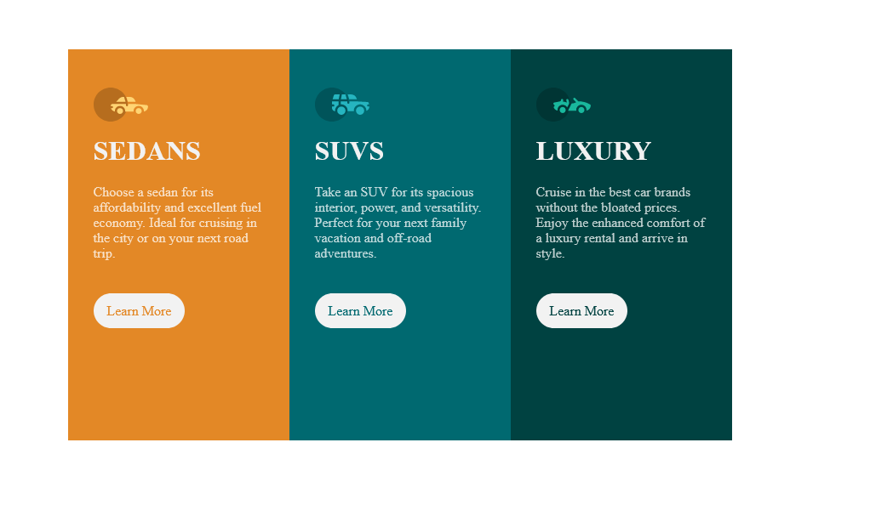

# Frontend Mentor - 3-column preview card component solution

This is a solution to the [3-column preview card component challenge on Frontend Mentor](https://www.frontendmentor.io/challenges/3column-preview-card-component-pH92eAR2-). Frontend Mentor challenges help you improve your coding skills by building realistic projects. 

## Table of contents

  - [The challenge](#the-challenge)
  - [Screenshot](#screenshot)
  - [Links](#links)
- [My process](#my-process)
- [Author](#author)
- [Acknowledgments](#acknowledgments)

# The challenge

Users should be able to:

- View the optimal layout depending on their device's screen size
- See hover states for interactive elements

### Screenshot

### Links

- Solution URL:https://github.com/Eve-Wangari/3-card-preview.git
- Live Site URL:https://luminous-donut-ab2eb2.netlify.app/

## My process

### Built with

- Semantic HTML5 markup
- CSS custom properties
- Flexbox

## Author

- Website - [Everlyn Wangari](https://www.your-site.com)
- Frontend Mentor - @eve-wangari(https://www.frontendmentor.io/profile/eve-wangari)
-
